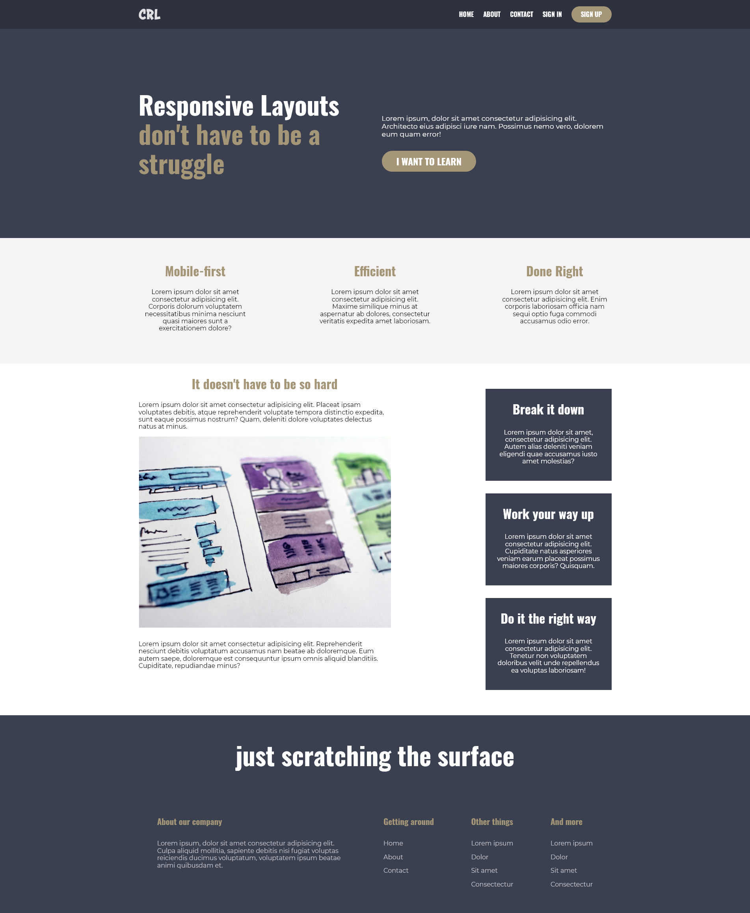
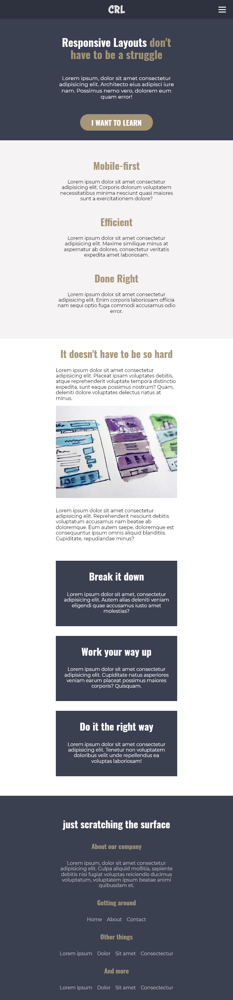
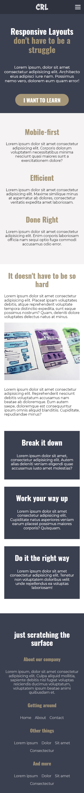
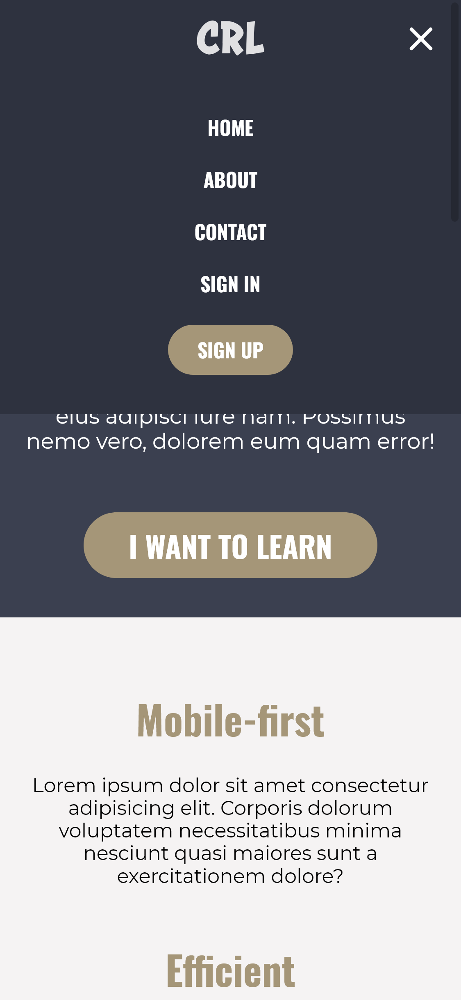

<!-- markdownlint-disable MD033 -->
<h1 align="center">Responsive Web Design - Last Challenge</h1>

Last challenge from Kevin Powell's free course <em>Conquering Responsive Layouts</em>

<h3 align="center">Languages</h3>

  <a href="#">English</a> • <a href="./lang/README.pt-br.md">Português</a>

<!-- markdownlin-enable MD033 -->

## Table of contents

- [Overview](#overview)
  - [The challenge](#the-challenge)
  - [Screenshots](#screenshots)
  - [Links](#links)
- [My process](#my-process)
  - [Built with](#built-with)
  - [What I learned](#what-i-learned)
- [Author](#author)

## Overview

### The challenge

- Responsive webpage made through mobile first approach
- Mobile dropdown menu

### Screenshots

| Desktop View (1280px) | iPad View (768px) | iPhone View (375px) | Others |
|---------|-------|------|------|
|||| |

### Links

- Live Site URL: [Github Pages](https://amodeusr.github.io/ResponsiveWebDesign-LastChallenge/)

## My process

### Built with

- Semantic HTML5 markup
- CSS custom properties
- Flexbox
- Mobile-first workflow
- Vanilla Javascript

### What I learned

It was my first time making a dropdown/hamburger menu, so it was challenging and exciting. It was considerably difficult, but just as satisfying as it could be to see it working and, honestly, beautifuly animated, considering it was my first try! 😁

I also learn how to make a ripple effect only using HTML and CSS. It isn't a 100% functional, in case it's used with a mouse — since it utilizes hover state — however it's suficiently functional, specially to give a tactile feeling on mobile.

## Author

- Github - [@AmodeusR](https://www.your-site.com)
- Linkedin - [@AmodeusR](https://www.linkedin.com/in/AmodeusR)
- Frontend Mentor - [@AmodeusR](https://www.frontendmentor.io/profile/AmodeusR)
